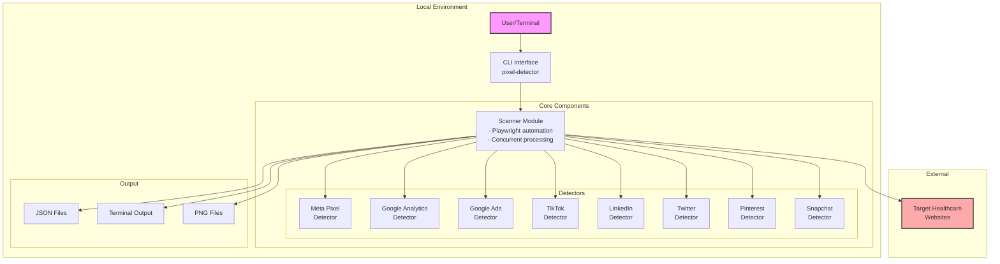
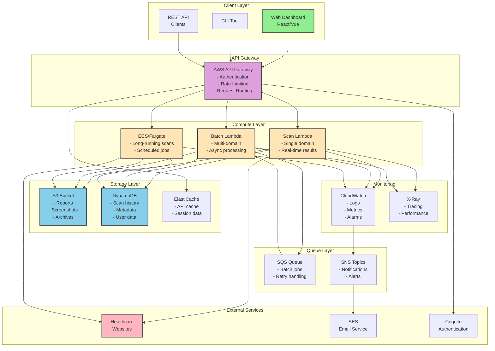
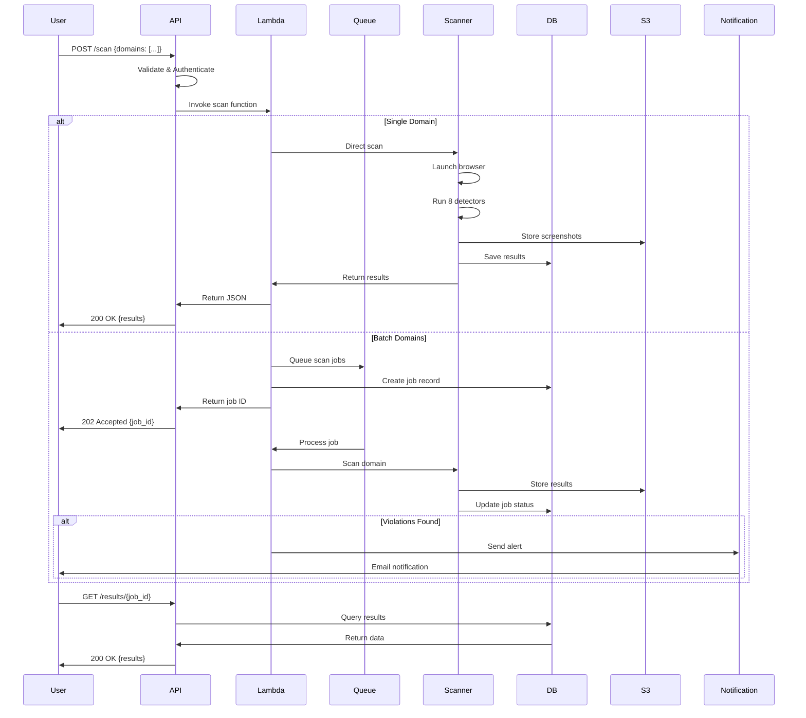
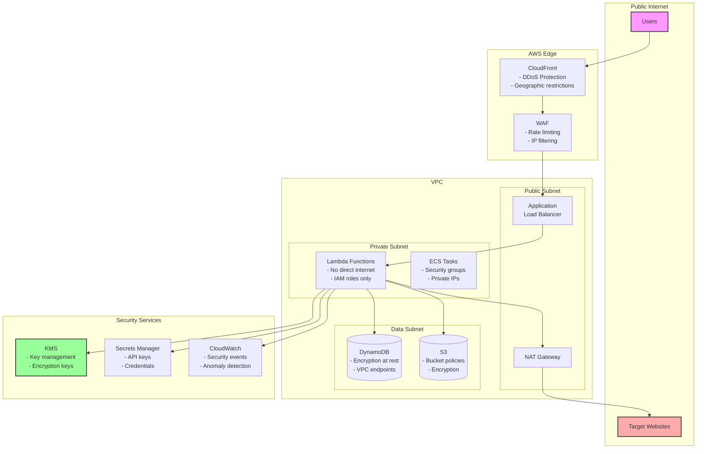

# Pixel Detector Architecture Diagrams

## Current Architecture (As-Is)

## Target Architecture (To-Be)

## Data Flow Diagram

## Component Interaction Matrix

| Component | Talks To | Protocol | Purpose |
|-----------|----------|----------|---------|
| CLI | API Gateway | HTTPS | Submit scan requests |
| Web UI | API Gateway | HTTPS | View results, manage scans |
| API Gateway | Lambda | AWS SDK | Invoke functions |
| Lambda | DynamoDB | AWS SDK | Store/retrieve data |
| Lambda | S3 | AWS SDK | Store files |
| Lambda | SQS | AWS SDK | Queue batch jobs |
| Lambda | CloudWatch | AWS SDK | Log events |
| CloudWatch | SNS | AWS Events | Trigger alerts |
| SNS | SES | AWS SDK | Send emails |
| Lambda | Target Sites | HTTPS | Scan websites |

## Security Architecture

## Scaling Strategy

### Current Limitations
- **Single machine**: Limited by local resources
- **Sequential scanning**: One domain at a time (or 5 with batch)
- **No persistence**: Results lost after execution
- **Manual process**: No automation or scheduling

### Future Capabilities
- **Horizontal scaling**: Unlimited Lambda concurrency
- **Batch processing**: 1000s of domains via SQS
- **Auto-scaling**: Based on queue depth
- **Scheduled scans**: Daily/weekly compliance checks
- **Global distribution**: Multi-region deployment

### Performance Targets
| Metric | Current | Target | Method |
|--------|---------|--------|--------|
| Domains/hour | 300 | 10,000 | Lambda concurrency |
| Availability | Local only | 99.9% | Multi-AZ deployment |
| Response time | N/A | <200ms | API caching |
| Storage | Local files | Unlimited | S3 + DynamoDB |
| Concurrent users | 1 | 1000+ | API Gateway scaling |